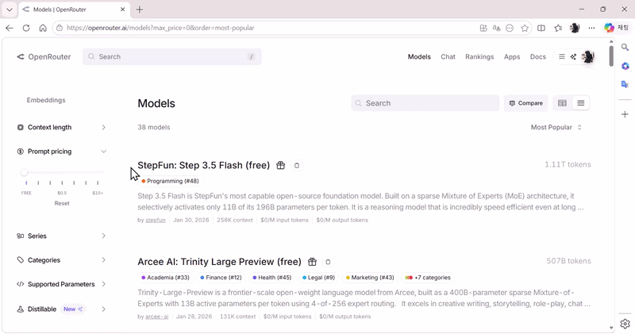

#  Orbital

**A free, open-source alternative to Snipdo for Windows.**

Orbital is a lightweight Windows tray app that pops up an AI-powered action bar whenever you select text, letting you translate, summarize, rewrite, search, or run any custom prompt in one click, right where you're working.

---

## How It Works

Orbital watches your mouse and keyboard globally and shows a floating action bar above your cursor whenever text is selected.

| Trigger | How to activate |
|---------|----------------|
| **Mouse drag** | Click and drag to select text anywhere on screen. When you release the mouse button, Orbital reads the selection and shows the action bar. |
| **Double-click** | Double-click a word in a text field. Orbital detects the word selection and shows the action bar. |
| **Keyboard selection** | Select text with **Shift + arrow keys**, **Shift + Home/End/Page Up/Down**, or **Ctrl+A**. Orbital shows the action bar when you release Shift. |
| **Custom hotkey** | Press your configured shortcut (set in Settings) to trigger the bar for whatever text is currently selected. |
| **Long press** | Hold the left mouse button (300 ms or more) without dragging in a text field. The action bar appears with clipboard/paste actions available. |

Click any action button to run it. Dismiss with **Esc**, a **right-click**, or clicking outside the bar.

---

## Why Orbital?

[Snipdo](https://snipdo-app.com/) pioneered the idea of a floating toolbar on text selection, but it's **subscription-only**. Orbital is the free, open-source answer:

| | Orbital | Snipdo |
|---|---|---|
| Price | **Free** | Subscription |
| Source | **Open source** (MIT) | Closed |
| AI provider | **Any OpenAI-compatible API** | Proprietary |
| Custom prompts | **Unlimited** | Limited |
| Local models | **Yes** (Ollama, LM Studio) | No |
| Platform | Windows 10/11 | Windows |

---

## Features

- **Instant action bar** - select any text anywhere on Windows and get a floating pill menu above your cursor
- **Multiple trigger methods** - mouse drag, double-click, keyboard selection (Shift+arrows / Ctrl+A), long-press, or a custom hotkey
- **AI actions** - Replace, Copy to clipboard, or Popup with AI-generated results
- **Utility actions** - Copy, Cut, Paste, Delete, key simulation, and Google Search without any AI calls
- **Keyboard-friendly** - works with Shift+arrow key selection and Ctrl+A; Paste/Cut automatically hidden in read-only contexts
- **Windows 11-inspired UI** - refined Fluent-style colors, spacing, and control styling across the app
- **Modern settings surfaces** - the Settings window and Edit Action dialog were refreshed to feel more native on current Windows builds
- **System accent integration** - primary actions and selected states follow your Windows accent color when available
- **Backdrop on supported systems** - standard app windows opt into Windows 11 backdrop treatment with graceful fallback on unsupported versions
- **Bring your own model** - works with OpenAI, OpenRouter (including free models), Ollama, LM Studio, or any OpenAI-compatible endpoint
- **Custom prompts** - add, edit, and reorder actions with your own prompt templates using `{text}` as a placeholder
- **Custom hotkey** - configure any key combination (e.g. Ctrl+Shift+Space) in Settings to trigger the bar on demand
- **Privacy** - API keys encrypted with Windows DPAPI; fully offline with local models (Ollama / LM Studio)
- **Secure key storage** - API keys are encrypted with Windows DPAPI, stored locally

---

## Demo

> Select text -> action bar appears above cursor -> click an action



---

## UI Refresh

Recent releases moved Orbital closer to modern Windows 11 app styling without changing the lightweight overlay workflow that makes it useful.

- Standard windows now use a calmer Fluent-inspired palette, updated control styling, and tighter spacing.
- `Settings` and `Edit Action` were modernized first, since they benefit most from native-feeling window chrome and layout polish.
- Overlay surfaces such as the action bar and result popup keep their transparent WPF implementation for stability, rather than forcing unsupported Mica/Acrylic behavior.

---

## Getting Started

### Requirements

- Windows 10 or 11 (x64)
- .NET 8 Runtime ([download](https://dotnet.microsoft.com/download/dotnet/8.0))

### Download

Grab the latest release from the [Releases](../../releases) page.

- **Installer**: Run `Orbital-Setup.exe` - installs to Program Files with an uninstaller
- **Portable**: Extract the zip and run `Orbital.exe` directly - no installation required

### First-time Setup

1. Run `Orbital.exe` - a tray icon appears in the bottom-right corner
2. Double-click the tray icon (or right-click -> **Settings**)
3. Choose your AI provider and enter your API key
4. Start selecting text anywhere on your desktop

#### Free option - no credit card required

Select **OpenRouter** as the provider and use `openrouter/free` as the model name. OpenRouter automatically routes to available free models at no cost.

---

## Configuration

### Providers

| Provider | Base URL | Notes |
|---|---|---|
| OpenAI | `https://api.openai.com/v1` | Requires paid key |
| OpenRouter | `https://openrouter.ai/api/v1` | Free tier available |
| Ollama (local) | `http://localhost:11434/v1` | No API key needed |
| LM Studio | `http://localhost:1234/v1` | No API key needed |
| Any other | custom URL | Must be OpenAI-compatible |

### Action Types

| Output Mode | Description |
|---|---|
| `Replace` | AI result overwrites your selected text (Ctrl+V) |
| `Copy` | AI result is copied to clipboard |
| `Popup` | AI result shown in a floating window (20s auto-close) |
| `DirectCopy` | Copies selected text as-is - no AI |
| `Cut` | Cuts selected text - no AI |
| `Paste` | Pastes clipboard at cursor - no AI |
| `Browser` | Opens Google Search with selected text - no AI |
| `Delete` | Deletes selected text without touching the clipboard - no AI |
| `SimulateKey` | Presses a key at the cursor - key name set in the Prompt field (see below) - no AI |
| `SelectAll` | Selects all text in the focused control (Ctrl+A), then re-shows the action bar so you can act on the full selection - no AI |

#### SimulateKey - supported key names

Set **Output** to `SimulateKey` and put one of the following key names in the **Prompt** field:

| Prompt value | Key pressed |
|---|---|
| `Enter` or `Return` | Enter |
| `Space` | Space bar |
| `Delete` | Delete |
| `Backspace` | Backspace |
| `Escape` or `Esc` | Escape |
| `Tab` | Tab |

**Example - press Enter after selecting text:**

```text
Name:   Confirm
Prompt: Enter
Output: SimulateKey
```

### Custom Prompt Example

```text
Name: Fix English
Prompt: Correct grammar and make the following text sound natural and professional: {text}
Output: Replace
```

---

## Building from Source

```bash
git clone https://github.com/CrowKing63/Orbital.git
cd Orbital
"C:\Program Files\dotnet\dotnet.exe" build Orbital.csproj
./bin/Debug/net8.0-windows/Orbital.exe
```

**Requirements:** .NET 8 SDK, Windows

The project uses WPF for UI and WinForms only for the `NotifyIcon` tray integration.

---

## Security / Antivirus False Positives

Some antivirus programs (notably Kaspersky) flag `Update.exe`, the auto-updater installed by Velopack to `%LocalAppData%\Orbital\Update.exe`, as a trojan (`Trojan.Win32.Zapchast` or similar). **This is a false positive.**

### Why does this happen?

Orbital releases are currently **unsigned**. No code-signing certificate is applied to the binaries. Antivirus heuristics treat unsigned executables that run silently in the background (as Velopack's updater does) as suspicious, even when the code is entirely benign.

### What you can do

- **Portable users**: Use the `Orbital-*-Portable.zip` release instead of the installer. The portable build does not install `Update.exe`.
- **Installer users**: Add `%LocalAppData%\Orbital\Update.exe` to your antivirus exclusions, then re-run the installer.
- **Verify the source**: You can inspect the full source code of Orbital in this repository. Releases are built automatically by [GitHub Actions](.github/workflows/release.yml) from this source with no manual steps.

### Long-term fix

Code signing requires purchasing an OV or EV certificate ($100-$500/yr). This is on the roadmap. Once signed, AV false positives should disappear entirely.

---

## Contributing

Pull requests are welcome. For major changes, please open an issue first.

Areas where contributions are especially appreciated:

- **More default actions** - practical prompt templates for common tasks
- **UI improvements** - accessibility, animations, DPI edge cases
- **Localization** - translations for the Settings UI
- **Packaging** - MSIX installer, winget manifest, GitHub Actions release pipeline

---

## License

[MIT](LICENSE)

---

## Acknowledgements

Inspired by [Snipdo](https://snipdo-app.com/), which showed that a floating text-action toolbar on Windows is genuinely useful and that the market needs a free, open alternative.
